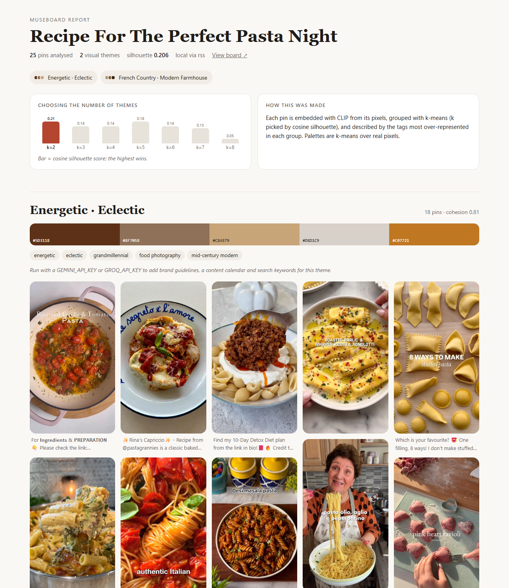
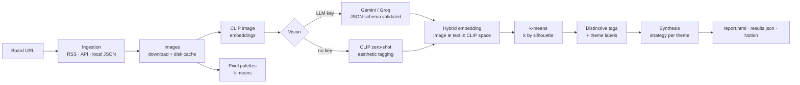

# MuseBoard

[](https://github.com/nimnay/MuseBoard/actions/workflows/ci.yml)

**Turn a Pinterest board into the visual themes hiding inside it** — each with a real color palette, the tags that set it apart, and (with an LLM key) brand direction, a content calendar, and Pinterest search keywords.

```bash
museboard https://www.pinterest.com/pinterest/recipe-for-the-perfect-pasta-night/
```



<sub>Report above was generated with **no API keys** (local CLIP mode). Full output: [`examples/pasta-night/`](examples/pasta-night/).</sub>

---

## Quickstart — no API keys needed

```bash
git clone https://github.com/nimnay/MuseBoard && cd MuseBoard
python -m venv .venv && source .venv/bin/activate      # Windows: .venv\Scripts\activate
pip install -e .
museboard https://www.pinterest.com/<user>/<public-board>/ --open
```

That reads the board's public feed, embeds every image with CLIP on your machine, clusters them, and opens an HTML report. The first run downloads the CLIP model (~600 MB).

To unlock richer tagging and a content strategy per theme, copy `.env.example` to `.env` and add a free [Gemini key](https://aistudio.google.com/apikey) (or a Groq key). Nothing else changes — `auto` mode picks it up.

| You have | You get |
|---|---|
| Nothing | Themes, pixel palettes, CLIP zero-shot tags, HTML + JSON report |
| `GEMINI_API_KEY` or `GROQ_API_KEY` | + schema-validated vision tags, LLM theme names, brand guidelines, 4-week content calendar, search keywords |
| `NOTION_API_KEY` + `--notion-db` | + one Notion database page per theme |
| `PINTEREST_ACCESS_TOKEN` | Read boards via the official API instead of RSS (boards your account owns) |

## How it works



Each stage is timed and logged; a run prints one line per stage and records itself in `cache/runs.sqlite`, with full JSON-lines logs in `logs/<run_id>.jsonl`.

```
[Ingestion ] ✓  in=0   out=25     0.9s
[Images    ] ✓  in=25  out=25     1.7s
[CLIP      ] ✓  in=25  out=25    41.5s
[Vision    ] ✓  in=25  out=25     4.9s
[Embedding ] ✓  in=25  out=25     0.0s
[Clustering] ✓  in=25  out=2      0.4s
[Synthesis ] –  in=0   out=0      0.0s  local provider — add an LLM key for strategies
[Report    ] ✓  in=2   out=2      0.0s
```

<sub>Real run on a Windows laptop, CPU only. The CLIP line is mostly the one-time torch/model load; encoding 25 images takes ~6s.</sub>

## Design decisions

**Public RSS by default, not the Pinterest API.** API v5 addresses boards by numeric ID and a token can only read boards its owner has access to, so "paste any board URL" can't work through it. Every public board has an RSS feed with its ~25 most recent pins — enough to find themes, and it needs no credentials. The API source is still there (`--source api`) and correctly resolves a board's ID by listing the owner's boards.

**Embeddings from pixels *and* meaning.** Pure image embeddings over-weight color and layout (two pastel photos look alike even if one is nails and one is a cake); pure text embeddings inherit every quirk of an LLM's wording. CLIP puts images and text in the same space, so each pin's vector is a 50/50 blend of its image embedding and the embedding of its vision description.

**k is measured, not assumed.** Boards don't come in fours. k-means runs for k = 2…8 and the cosine silhouette score picks the winner; the report shows the scores so the choice is inspectable.

**Labels from what's *distinctive*, not what's common.** Ranking tags by raw frequency makes every cluster on a cozy board say "cozy". Tags are ranked by how much more common they are inside a cluster than across the board.

**Palettes from pixels, not the model.** LLMs are bad at reporting exact hex codes. Palettes are k-means over the actual pixels (nearest-neighbour sampled, so no invented blend colors), and theme palettes merge members' palettes weighted by rank.

**Fail loudly on bad model output.** Every LLM vision response is validated against a versioned JSON Schema ([`schemas/vision-schema.json`](src/curator_agent/schemas/vision-schema.json)). If fewer than 90% of pins validate, the run stops instead of clustering garbage. Strategies are schema-validated too.

**Cheap to iterate.** Images, pins and per-pin vision results are cached on disk (keyed by provider, model and schema version), so tweaking clustering or the report doesn't spend LLM quota again. Retries back off exponentially on 429/5xx only, honouring `Retry-After`.

## Limitations (honestly)

- **RSS returns ~25 pins** — the most recent ones. Fine for theme discovery, not a full-board audit.
- **Local mode's tags are coarse.** CLIP zero-shot picks the nearest of ~80 vocabulary terms, so a pasta cluster can be labelled "Energetic · Eclectic". The clustering itself is image-driven and holds up; the *words* get much better with an LLM key.
- **Silhouette scores are modest** (typically 0.1–0.3). Real boards are curated around one idea, so themes overlap — the score is reported rather than hidden.
- **The Pinterest API and Notion paths are unit-tested with mocked HTTP but haven't been run against the live services** (I don't have Pinterest API access). RSS, local CLIP mode, and the full pipeline are tested end-to-end against real boards.

## CLI

```
museboard BOARD [options]

BOARD                     public board URL, or a path to a local pins JSON file
--source auto|rss|api|local
--provider auto|gemini|groq|local   auto: Gemini → Groq → local CLIP
--clusters auto|N         default auto (silhouette)
--max-pins N              default 50
--notion-db ID            also export to Notion (or set NOTION_DATABASE_ID)
--out DIR                 default output/<board>
--no-cache                refetch pins and re-run vision
--open                    open the report when done
```

Exit codes: `0` success · `2` invalid arguments or missing credentials · `3` a stage failed · `4` Notion export failed (results are already on disk).

## Development

```bash
pip install -e ".[dev]"
pytest          # 63 tests, fully offline — fake CLIP encoder and fake LLM, no keys or downloads
ruff check src tests
```

```
src/curator_agent/
  cli.py            argument parsing, provider/source resolution
  pipeline.py       stage orchestration, timing, run records
  sources/          rss.py · api.py · local.py  (+ board URL parsing)
  images.py         download cache, pixel palettes
  clip.py           CLIP image/text encoder
  llm.py            Gemini / Groq clients
  stages/           vision · embedding · clustering · synthesis · export
  report.py         results.json + self-contained report.html
  schemas/          versioned vision JSON Schema
tests/              unit + end-to-end tests
```

## Roadmap

- **Cross-board trends** — run over many boards and track which themes grow week over week.
- **"More like this"** — query the saved FAISS index with a new image to find the closest theme.
- **Evaluate labels** — a small hand-labelled board set to compare local vs LLM tagging quality.
